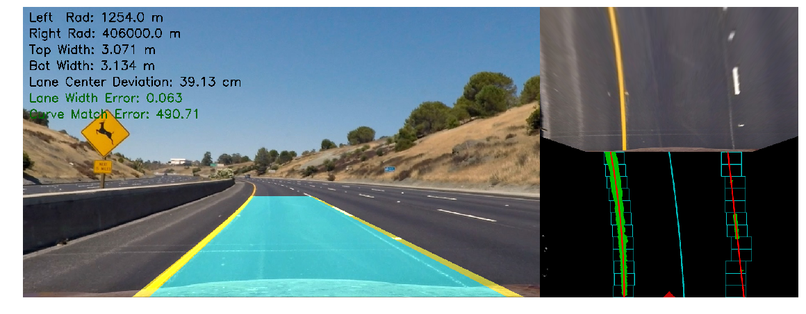

# **Finding Lane Lines On the Road (Advanced)**

### **Project Overview**

This project contains the results from completing Project 4 of the Udacity Self-Driving Car Engineer Nanodegree. The goal of this project is to build on our earlier work of [finding lane lines](https://github.com/liamondrop/finding-lane-lines) by using more sophisticated computer vision techniques.

#### Files in the repository
* The code for the project is all contained in the [project notebook](./project_notebook.ipynb)
* The main [project video](./output_videos/project_video_process.mp4)
* The [diagnostic video](./output_videos/project_video_diagnostic.mp4)
* A passable attempt at a somewhat more [challenging video](./output_videos/challenge_video_process.mp4)
* A [writeup](./WRITEUP.md) detailing the results of the project

#### Running the code
This project was developed using Python 3.5. The project depends on the [NumPy](http://www.numpy.org/), [OpenCV](http://opencv.org/), [Matplotlib](http://matplotlib.org/) & [MoviePy](http://zulko.github.io/moviepy/) libraries.
