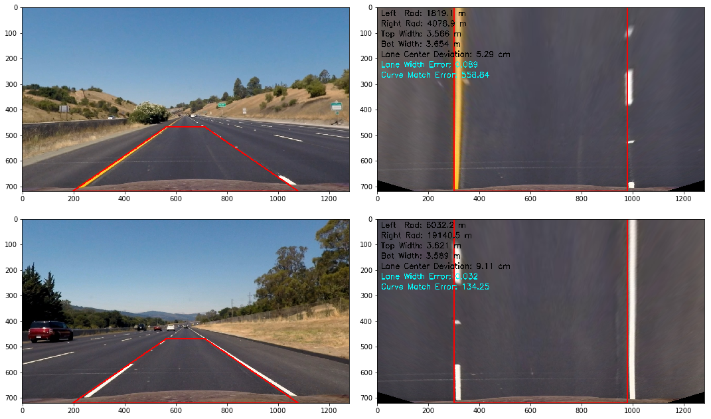
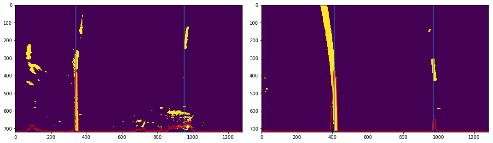
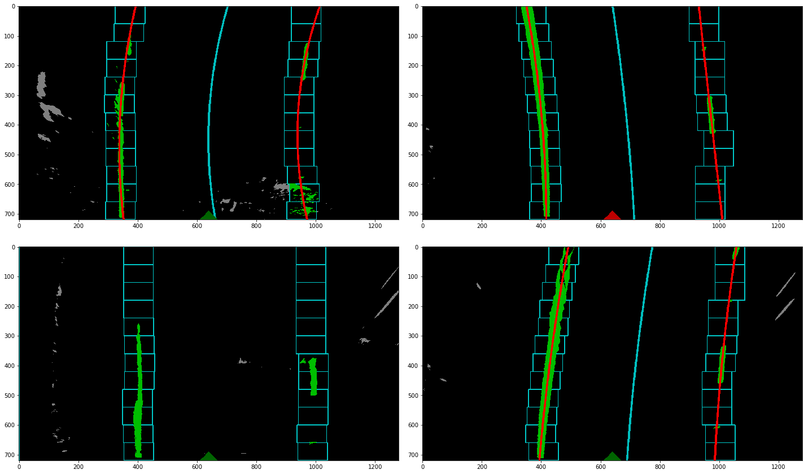

# **Finding Lane Lines (Advanced)**

## Preliminaries

### Camera Calibration

The images captured by a lensed (as opposed to a pinhole) camera are subject to some amount of distortion, due to the curvature of the lens, as well as other more subtle factors like the shape, orientation, and quality of the sensors that capture the light information. For these reasons, images captured by one camera are highly unlikely to be exactly like those captured by another. Accurately fitting the lane lines in this project requires warping the image to mimic a birds-eye perspective of the road. In order to do this accurately, it is necessary to correct for the lens distortion in an operation called camera calibration.

Camera calibration is accomplished by feeding in several images of a checkerboard pattern. We use a checkerboard pattern because the relative dimensions are known: namely, the 4 corners of a given checkerboard square when viewed head on should be equidistant from each other. By feeding in several images of these, taken at varying angles with the camera we mean to calibrate, and defining the number of corners we expect to find, it is possible to calculate the focal length, axis skew, and principle point offset parameters that compose the camera's intrinsic matrix[1] as well as its distortion coefficients[2], known as the intrinsic and extrinsic parameters of the camera. The code to accomplish this can be found in cells 3 and 4 of the [project notebook](./project_notebook.ipynb).


We start by initializing an "object points" matrix `objp`, which will contain the 3D (X, Y, Z) vector coordinates of the chessboard corners for each calibration image. The points are 3D, but since they are in a pattern coordinate system on a flat plane, we can make the simplifying assumption that the chessboard is fixed on an X,Y coordinate plane such that Z-coordinate of each input object point is 0. Thus, `objp` is just an array of corner coordinates, a copy of which we will re-append to `obj_points` for each successful detection of the chessboard corners in given test image. We also store the coordinates of the detected corners in the X,Y image plane to an "image points" list `img_points`.

```
# the ny*nx x 3 `objp` matrix for each detected chessboard corner image

[[ 0.  0.  0.]
 [ 1.  0.  0.]
 [ 2.  0.  0.]
 ...
 [ 0.  1.  0.]
 [ 1.  1.  0.]
 [ 2.  1.  0.]
 ...
 [ 0.  2.  0.]
 [ 1.  2.  0.]
 [ 2.  2.  0.]
 ...
 [ 6.  5.  0.]
 [ 7.  5.  0.]
 [ 8.  5.  0.]]
```

Now that we have these coordinates, we pass `obj_points` and `img_points` to the `cv2.calibrateCamera()` function in order to compute the camera matrix and distortion coefficients mentioned above.

### Undistortion and Perspective Transform

Armed with these two sets of parameters, it is now simple work to undistort any image by passing the parameters and the image, to `cv2.undistort()`. With the undistorted image, we can now make an accurate perspective transformation. This is accomplished by first defining two quadrangles. Then calculate the projection of the source (`src`) quadrangle to the destination quadrangle (`dst`) by passing the quadrangles to `cv2.getPerspectiveTransform()`, and use the resulting transformation matrix to transform the image.

The code to do this can be found in cell 5 of the project notebook, and the result of applying these operations to the checkerboard images can be seen here:


In the above image, we have located the 4 corners of the polygon bounding the detected chessboard corners in the undistorted image. These will be our `src`. The `dst` is simply a rectangle parallel to the image plane. Projecting from the `src` to the `dst` renders the image on the right. This operation is reversible, meaning we can get the perspective transform from the `dst` back to the `src` by simply reversing the arguments passed to `cv2.getPerspectiveTransform()`. This will come in handy later when we want to reproject our birds-eye image of the lane curves back onto the original input image.

## Image Processing Pipeline

The code for the image processing pipeline is contained in a class called `LaneDetector`, which resides in cell 7 of the project notebook, as well as a series of helper functions in cell 6. It's useful to use a class when processing images in a video stream, because this allows us to create an object instance, which enables storing data extracted from multiple video frames in memory in order to perform temporal calculations like the difference in lane curvature from one frame to the next, for example.

### 1. Projecting the Road Image to Birds-eye View

The first step of the pipeline for finding lane lines is to transform the image to a birds-eye view of the road. We do this by defining `src` and `dst` quadrangles, the first matching as closely as possible to the 3D coordinates of a plane coincident to the road in the image, and the second a projection of that rectangle parallel to the camera plane. The code to retrieve the two quadrangles is in the `get_quadrangles()` method of the `LaneDetector` class.

Next, we undistort the image, using the pre-calculated camera matrix and distortion coefficients, and apply a perspective transform using the `dst` and `src` quadrangles. Here is an example snippet of code I used to get the lanes as parallel as possible.

```python
# initialize the lane detector class with quadrangle offsets
ld = LaneDetector(quad_top=.651,
                  quad_lower=0.156,
                  quad_upper=0.444,
                  quad_projection_offset=140)

# get the image dimensions
rows, cols = image.shape[:2]

# pass the image dimensions to `get_quadrangles` in order to compute the shapes
src, dst = ld.get_quadrangles(rows, cols)

# undistort the image
undistorted = undistort_image(image)

# apply a perspective warp to the image
warped = warp_image(undistorted, src, dst, (cols,rows))
```

In the above code, the keyword arguments passed to the `LaneDetector` class at instantiation define the source and destination quadrangles. The `quad_top`, `quad_lower`, `quad_upper`, and `quad_projection_offset` arguments are real-valued numbers that represent percentages. For example, `quad_top` in this case is placed at 65.1% of the image height, while `quad_lower` and `quad_upper` are both percentage offsets from the left and right sides of the image. `quad_projection_offset` is the percentage from the left and right sides of the image where the sides of the `dst` quadrangle will be placed. Below are two views of relatively straight stretches of road that I used to decide on values of the quadrangle offsets and test that my perspective warping was accurate. The source and destination quadrangles are overlaid in red. Note that I used the lane widths and error metrics visible in the warped images, which will be discussed later, to find the optimal shapes. That said, this could be potentially be improved further by calculating those metrics across a larger sample of images and using gradient descent to find the best quadrangle offsets.



### 2. Color Filtering and Gradients

In order to find the lane lines in the transformed images, I used multiple techniques. The first was to transform the image to the HSV color space, and to perform histogram equalization (specifically, applying Contrast Limited Adaptive Histogram Equalization[3] on the V channel of the image). Once that was accomplished, it was possible to define continuous yellow and white color ranges to mask out anything in the image not in those ranges. This in itself got excellent results, nearly isolating the lane lines completely from other objects, especially in the main project video. However, to tease out some of the more challenging lane images, I used two Sobel filters with respect to the X axis of the image, because this tends to find large differentials in the X-axis, i.e. shapes running from the top to the bottom of the image that stand in high contrast to their surrounding pixels. Because the lane lines are more vertical than horizontal in the image and highly contrast with the dark gray pavement, they tend to be found by the Sobel filter. I applied this Sobel operation to both the S and V channels of the HSV image. However, I discarded the H channel as it yielded very little information not found in the other channels. After tweaking the threshold values for each filter, I arrived at a good balance between noise reduction and information gain. All filtered and thresholded values greater than zero were set to 1, while all other values are set to 0. Finally, each of the resulting binary images is unioned with a unary "or" operator.

```python
# transform the image to HSV color space and perform CLA Histogram Equalization
hsv = equalize_hist_hsv(warped)

# apply color filters to the HSV image; set nonzero values to 1
filtered_hsv = binary_image(filter_hsv_image(hsv))

# apply the sobel gradient in x to the S channel of the HSV image; set nonzero values to 1
sobel_s = binary_image(filter_sobel(hsv[:,:,1], ksize=3), thresh=(25, 255))

# apply the sobel gradient in x to the V channel of the HSV image; set nonzero values to 1
sobel_v = binary_image(filter_sobel(hsv[:,:,2], ksize=3), thresh=(50, 100))

# union each of the images to create a single binary image
binary = filtered_hsv | sobel_s | sobel_v
```


### 3. Finding Lane Lines and Fitting Curves

The binary images that resulted from the above filtering steps are really just 2-dimensional arrays composed of 1s and 0s. If we do a summation on each of the column of the image, we would get a higher value from the columns that have the most 1s. Then, if we take the column index of the maximum value from the left half and the right half of our image, assuming we've done a good job with filtering out most of the noise, these should be good starting coordinates from which to search for our lane lines.

```python
# the vertical middle of the image
mid_y = int(img.shape[0]/2)

# the horizontal middle of the image
mid_x = int(img.shape[1]/2)

# the column-wise sum of all the columns of the lower half of the image
histogram = np.sum(binary[mid_y:,:], axis=0)

# the index of the maximum value of the histogram for the left and right halves of the image
initial_x_left = np.argmax(histogram[:mid_x])
initial_x_right = np.argmax(histogram[mid_x:]) + mid_x
```



#### Sliding Window Search

With our initial X values located, we now create a search window with a 100px margin to either side of the X value and a height of 1/12 of the image height. We save the coordinates of every non-zero pixel within the bounds of this window, compute the mean X value of all these pixels (assuming we found at least 50 such pixels), set that X value as the center of the next search window, which will use the top of the current window as its base and again have a height of 1/12 the image height. Proceeding this way iteratively until we reach the top of the image, we should have collected a group of pixel indices that will make up the X,Y coordinates of a number of points closely matching the lane lines in the image.

The code for this procedure can all be found in the `sliding_window_search()` method of the `LaneDetector` class. Visualized, the sliding window search looks like the image below, where the bluish rectangles represent our search windows and the red curves are the plotted polynomial functions that minimize the squared error of all the highlighted pixels in green.



#### Lookahead Search

Since we will be finding lane lines across a stream of video images, there should be relatively minor variation in the curves from one frame to the next. That means that, rather than having to start from scratch with a sliding window search for every frame, we can search a margin to the left and right of each found curve to locate the pixels of the next curve within that margin. The code for this lookahead search procedure is located in the `lookahead_search()` method of the `LaneDetector` class and is visualized in the image below.


### 4. Fitting A Curve To The Found Points

With our sets of found points for left and right lanes, it is now possible to fit a 2nd degree polynomial that minimizes the squared error of all the points, using Numpy's `polyfit()` function by passing all the X and Y coordinates of the points. This returns the 3 coefficients of the curve (A,B,C). Passing these coefficients to Numpy's `poly1d()` returns a function that will return an X value lying on the curve for any given Y. By simply passing a range of values from 0 to the pixel height of the image, we now have the pixel coordinates of our lane curve. These

### 5. Measuring the Radius of Curvature and Vehicle Position

#### Radius of Curvature

The radius of curvature of a curve is defined as the radius of the circular arc which best approximates the curve at a given point[4]. This radius changes as we move along the curve. The formula for the radius of curvature at any point x is given as:


In python, we can re-write this as `(1 + (2*A*y_val + B)**2)**1.5 / np.abs(2*A)` where A, B, and C are the coefficients of the 2nd degree polynomial defining a curve. Since we'd like to match this curvature to the real world, we scale the initial values used to create the curve function by some constant mapping a pixel width and height to meters. This returns us the radius values for the left and right lane lines that you see overlaid on the output video below. As expected, when the road is closer to straight, the radius of the circle becomes very large. And as the curve in the road becomes sharper, the radius shrinks. Of course, the precision of this procedure is not likely to be exact as the perspective warp is not a perfect mapping from the real world, but it provides a decent approximation.

#### Vehicle Position

In order to judge the vehicle's position relative to the center of the lane, it's only necessary to calculate the mean of the X values of the detected lane lines at the bottom of the image. Since the camera is mounted in the car's center, calculating the difference between the image's horizontal midpoint and the lane center yields the relative position. This difference can then be scaled by the same constant we used to calculate the radius of curvature in meters.

### 6. Projecting the Curves Onto the Original Image

Now that we have found our curves, the remaining steps of the image processing pipeline are simple. We have already defined our source and destination quadrangles. All we have to do to is reverse them by getting the perspective transform from the destination to the source quadrangle and calling `cv2.warpPerspective()` on the curve image. Then we simply overlay that warped curve image atop the original image, using `cv2.addWeighted()`, which should render something like the following:


### 7. Fine Tuning

The steps above outline a procedure for processing every frame in a video. However, not every frame is perfect. Sometimes, noise in the images creates false positive matches and our lanes are drawn incorrectly. Also, there is a certain amount of jitter when drawing from one lane to the next that it would be desirable to smooth.

#### Sanity Checking

To address the first problem, I put some sanity checks in place. First of all, lane lines should be essentially parallel and should match each other's curvature pretty closely. The procedure I use to measure the curve similarity is as follows:

```python
# Compute the difference between the last (i.e. the base)
# x values of the left and right lanes
x_diff = x_right[-1] - x_left[-1]

# Translate the right lane so that the left and right lanes both have the same base x value
x_right_prime = x_right - x_diff

# Compute the sum of the squared differences (error) to quantify the difference in the 2 curves
ssd = np.sqrt(np.sum((x_left-x_right_prime)**2))
```

Similarly, I also ensure that the distance between the lane lines is roughly the same at the top and the bottom, i.e. that the lines are parallel. I also check that the distance between the lane lines is greater than some minimum threshold and less than some maximum threshold. Any pair of lanes that fail to pass these checks is discarded.

#### Temporal Smoothing

The initial results of drawing the found lane lines and projecting them back to the video frames worked quite well, in that the curves appeared to closely match the lane lines in any individual frame. However, there was a certain amount of jitter from frame to frame, as the information is sometimes sparse, rendering curves that do not closely match the one before it, as well as the lanes that did not pass the sanity checks being discarded.

To counter this, I created a buffer for each of the lane lines. Essentially, I created 2 lists, to which I appended the latest set of curve coefficients for each new frame. Keeping only the most recent N sets of curve coefficients in the buffer, I computed the mean curve coefficients and plotted these to obtain the current curve. This created a much smoother transition from frame to frame. I settled on a maximum buffer size of 3, which provides temporal smoothing, but also doesn't appear to lag much behind the video, which tends to happen if the buffer size is much larger.

Here is a link to my final, smoothed [output video](./output_videos/project_video_process.mp4).

#### Troubleshooting

By stacking a few different stages of the pipeline process together, I was able to create a diagnostic screen, which helped to understand and troubleshoot when the lanes didn't behave as expected. The code to accomplish this can be found in the `assemble_diagnostic_screen()` method of the `LaneDetector` class.


Here is a link to a [diagnostic video](./output_videos/project_video_diagnostic.mp4).

### Considerations for Future Improvements

#### Using Fixed Quadrangles

Using two fixed quadrangles for the perspective transform is not really ideal. Whenever the angle of the ground relative to the vehicle changes, for example, when the car encounters bumps or descends a hill, the warped birds-eye image fluctuates and the lanes quickly lose their apparent parallelism, making it very difficult to determine whether the lane lines are valid. I believe a more robust system would use dynamic ground-plane estimation methods to compute and project the destination quadrangle onto the ground. However, there is not time to explore that topic in the current project.

#### Better Filtering

Distinguishing signal from noise is crucial for generating well-fitting lane lines. As seen in the challenge video, when lines do not strongly contrast with the surrounding pavement, it can be difficult to find them in the image, especially when there are other artifacts on the road, like tar or cracks. Shifting quickly from bright light to shadow also poses a challenge. Currently, the project uses fixed color ranges that do a pretty good job of isolating the lane lines across the two videos, generally. However, at times, the lane colors fall well outside of those ranges. It would be interesting to experiment with dynamic color ranges that are centered on some set of values, such as the mean value of the current frame and attempting to locate the colors that are yellower and whiter than their surroundings, even if they wouldn't appear to be yellow or white placed next to a lane in full sunlight.

## References

- [1] [Dissecting the Camera Matrix, Part 3: The Intrinsic Matrix](http://ksimek.github.io/2013/08/13/intrinsic/)
- [2] [OpenCV calibrateCamera](http://docs.opencv.org/2.4/modules/calib3d/doc/camera_calibration_and_3d_reconstruction.html#calibratecamera)
- [3] [Contrast Limited Adaptive Histogram Equalization](https://en.wikipedia.org/wiki/Adaptive_histogram_equalization#Contrast_Limited_AHE)
- [4] [Radius of Curvature](https://en.wikipedia.org/wiki/Radius_of_curvature)
